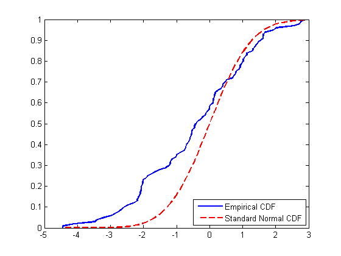

# Power law. Descriptive network analysis.

```{r, echo=FALSE, include=FALSE}
library(igraph)
library(ggplot2)
```

## Problem 1

##### Description

Recall from the lecture that probability density function (PDF) for power law distributed variable is: $$p(x) = Cx^{-\alpha}$$
Take logarithm of both sides: $$\log{p(x)} = \log{C} - \alpha \log{x}$$
Now you can use standard R functions like `lm()` to calculate $\alpha$ coefficient via linear regression. However you might find that it is a bad idea. 

Alternatively, you can compute cumulative density function (CDF) $$f(x) = Pr(x < X)$$ of power law distribution. Good things about CDF of the power law are:

* It still has form of power law
* On log-log plot it looks more like a line

***  

##### 1. Deriving the formula for CDF function of power law $F(x)$

By definition, the cumulative distribution function is $F(x) = \int_{-\infty}^{x} p(y)dy$. In our case of power law distributed variable $x$ starts from some $x_{min} > 0$, otherwise we may get division by zero in PDF or the power of negative number. Thus, the CDF is:
$$F(x) = \int_{x_{min}}^{x} p(y)dy = \int_{x_{min}}^{x} Cy^{-\alpha}dy = \frac{C}{-\alpha+1} \left(x^{-\alpha+1} - x_{min}^{-\alpha+1} \right)$$
Now let's find the constant $C$ using the fact that $\lim_{x\to+\infty}F(x)=1$. Also notice that $\alpha > 1$, otherwise the integral of CDF won't converge.
$$\lim_{x\to+\infty} \frac{C}{-\alpha+1} \left(x^{-\alpha+1} - x_{min}^{-\alpha+1} \right) = 1 \implies$$ 
$$\frac{C}{-\alpha+1}\left(\lim_{x\to+\infty}x^{-\alpha+1} - \lim_{x\to+\infty}x_{min}^{-\alpha+1}\right) = 1 \implies$$ 
$$\frac{C}{-\alpha+1}x_{min}^{-\alpha+1} = -1 \implies$$
$$C = (\alpha-1)x_{min}^{\alpha-1}$$
Therefore,
$$F(x) = -x_{min}^{\alpha-1}\left(x^{-\alpha+1} - x_{min}^{-\alpha+1} \right) = 1 - x_{min}^{\alpha-1}x^{-\alpha+1}$$

***  

##### 2. Plotting PDF and CDF of degree distribution of Internet Network in log-log scale

```{r}
internetNetwork <- read.graph(file = 'Internet_AS.gml', format = 'gml')
degDist <- as.data.frame(x = table(degree(internetNetwork)), stringsAsFactors = FALSE)
names(degDist) <- c('deg', 'freq')
degDist$deg <- as.integer(x = degDist$deg)
# there's one vertex with 0 degree so let's remove
# the corresponding row
# otherwise the logarithm cannot be applied
degDist <- subset(x = degDist, deg > 0)
rownames(degDist) <- 1:nrow(degDist)
qplot(x = deg, y = freq, data = degDist, log = 'xy',
      main = 'PDF', xlab = 'log of degree', ylab = 'log of frequency')
```

```{r}
degDist$cumFreq <- cumsum(degDist$freq)
qplot(x = deg, y = cumFreq, data = degDist, log = 'xy',
      main = 'CDF', xlab = 'log of degree', ylab = 'log of frequency')
```

***

##### 3. Fitting linear regression model to PDF and CDF to estimate $\alpha$

```{r}
linearFitPDF <- lm(formula = log(freq) ~ log(deg), data = degDist)
degDist$freqLM <- exp(x = fitted(object = linearFitPDF))
ggplot(data = degDist, mapping = aes(x = deg, y = freq)) + 
  geom_point() + 
  scale_x_continuous(name = 'log of degree',
                     breaks = c(1, 10, 100, 1000, max(degDist$deg)),
                     trans = 'log10') +
  scale_y_continuous(name = 'log of frequency', 
                     breaks = c(1, 10, 100, 1000, max(degDist$freq)),
                     trans = 'log10') +
  geom_line(mapping = aes(y = freqLM), colour = 'green') +
  ggtitle(label = 'PDF')
```

**The value of $\alpha$ is `r round(abs(coef(linearFitPDF)[2]), 3)`.**

```{r}
linearFitCDF <- lm(formula = log(cumFreq) ~ log(deg), data = degDist)
degDist$cumFreqLM <- exp(x = fitted(object = linearFitCDF))
ggplot(data = degDist, mapping = aes(x = deg, y = cumFreq)) + 
  geom_point() + 
  scale_x_continuous(name = 'log of degree',
                     breaks = c(1, 10, 100, 1000, max(degDist$deg)),
                     trans = 'log10') +
  scale_y_continuous(name = 'log of frequency', 
                     breaks = c(1, 10, 100, 1000, 10000, max(degDist$cumFreq)),
                     trans = 'log10') +
  geom_line(mapping = aes(y = cumFreqLM), colour = 'green') +
  ggtitle(label = 'CDF')
```


## Problem 2

##### Description

Kolmogorov-Smirnov test describes how similar are two distributions. In our case, when we have fitted model and original data, we can calculate their CDFs and Kolmogorov-Smirnov test shows us how well model approximates original data. In other words, it shows us the goodness-of-fit of our model. $$D = \max_{x} \|f(x|\alpha,x_{min}) - f_{emp}(x)\|\text{,}$$ where $f(x|\alpha,x_{min})$ and $f_{emp}(x)$ are theoretical and empirical CDFs respectively.



To estimate $x_{min}$ of the fitted power-law model we can use KS test: 

* Pick some $x_{min}$ value
* Fit power-law distribution to data (that is estimation of $\alpha$) -- now we have $f(x|\alpha,x_{min})$
* Perform KS test -- compute $D$ statistic
* Finnaly, choose $x_{min}^*$ that provides minimal value of $D$ statistic among all KS tests run above. 

In R all this stuff can be done in one line of code.

***  

##### 1. Using `power.law.fit` to find `xmin` value and corresponding `alpha`

```{r}
fitPL <- power.law.fit(x = degree(internetNetwork), implementation = 'plfit')
xmin <- fitPL$xmin
alpha <- fitPL$alpha
plc <- (alpha - 1) * xmin**(alpha - 1)
```

The values of $x_{min}$ and $\alpha$ are `r xmin` and `r round(alpha, 3)` respectively.

***

##### 2. Fitted model vs empirical PDF (CDF)

```{r}
# Since there is no easy way to ggplot power law fit line simultaneously with data 
# in proper scale (it requires to move the line vertically and rescale it also) 
# switching back to usual R plots
plFitPDF <- function(x) return(plc * x**(-alpha))
plot(x = degDist$deg, y = degDist$freq, type = 'p', log = 'xy', main = 'PDF', 
     xlab = 'log of degree', ylab = 'log of frequency', pch = 19, cex = 0.8)
par(new = TRUE, ann = FALSE)
curve(expr = plFitPDF, from = xmin, to = max(degDist$deg), 
      log = 'xy', col = 'green', main = '', axes = FALSE)
```

```{r, warning=FALSE}
plFitCDF <- function(x) return(1 - xmin**(alpha-1) * x**(1-alpha))
plot(x = degDist$deg, y = degDist$cumFreq, type = 'p', log = 'xy', main = 'CDF', 
     xlab = 'log of degree', ylab = 'log of frequency', pch = 19, cex = 0.8)
par(new = TRUE, ann = FALSE)
curve(expr = plFitCDF, from = xmin, to = max(degDist$deg), 
      log = 'xy', col = 'green', main = '', axes = FALSE)
```


## Problem 3

At first, let's load the graph.

```{r}
edgeList <- t(as.matrix(read.table(file = 'Wiki-Vote.txt')))
wV <- graph(edgeList)
```


##### 1. The number of vertices and edges

```{r}
vertexN <- as.integer(vcount(wV))
edgeN <- as.integer(ecount(wV))  # it doesn't return an integer somehow
```

The number of vertices is `r vertexN`. The number of edges is `r edgeN`.

##### 2. The number of loops (edges that start and end at the same vertex)

```{r}
loopN <- sum(which_loop(graph = wV))
```

The number of loops is `r loopN`.

##### 3. The number of symmetrical edges

```{r}
symmEdgeN <- reciprocity(graph = wV, mode = 'default') * edgeN / 2
```

The number of symmetric edges is `r symmEdgeN`

##### 4. Degree distribution

```{r}
wDist <- as.data.frame(x = table(degree(wV)), stringsAsFactors = FALSE)
names(wDist) <- c('deg', 'freq')
wDist$deg <- as.integer(x = wDist$deg)
wDist <- subset(x = wDist, deg > 0) # because of 0 degree vertices, log won't work
rownames(wDist) <- 1:nrow(wDist)
ggplot(data = wDist, mapping = aes(x = deg, y = freq)) +
  geom_point() + 
  scale_x_continuous(name = 'log of degree',
                     breaks = c(1, 10, 100, max(wDist$deg)),
                     trans = 'log10') +
  scale_y_continuous(name = 'log of frequency',
                     breaks = c(1, 10, 100, 1000, max(wDist$freq)),
                     trans = 'log10') +
  ggtitle(label = 'Degree Distribution of Wiki-Vote Graph (log-log)')
```


##### 5. The number of nodes with a degree greater than 1 and with a degree greater than 15

```{r}
wDeg <- degree(graph = wV, mode = 'all')
degL1 <- sum(wDeg > 1)
degL15 <- sum(wDeg > 15)
```

The number of nodes with degree greater than 1 is `r degL1`, with degree greater than 15 is `r degL15`.

##### 6. Find strongly connected components and their sizes

```{r}
wSCC <- components(graph = wV, mode = 'strong')
wSCCN <- count_components(graph = wV, mode = 'strong')
```

The number of strongly connected components is `r wSCCN`.

##### 7. Take subgraph of the original graph, which consists of the first 80 vertices and set color into red for those nodes in which the number of incoming edges is greater than the number of outgoing edges.Otherwise, set color in blue. For nodes with the same number of incoming and outgoing edges set color into green. Besides that, increase the size of vertices with a maximum value of transitivity (for example, you may set size into 10 for these nodes and 1 for others). 

```{r fig.height=10, fig.width=10}
minWV <- induced.subgraph(graph = wV, v = 1:80)
inDeg <- degree(graph = minWV, mode = 'in'); outDeg <- degree(graph = minWV, mode = 'out')
V(minWV)$color <- ifelse(inDeg > outDeg, 'red', ifelse(inDeg < outDeg, 'cyan', 'green'))
maxTrans <- max(transitivity(graph = minWV, type = 'local'), na.rm = TRUE)
V(minWV)$size <- ifelse(transitivity(graph = minWV, type = 'local') == maxTrans, 16, 7)
V(minWV)$size[is.na(V(minWV)$size)] <- 7
plot(minWV)
```


##### 8.Take subgraph from the previous task and find maximal connected component. For this component highlight any way that corresponds to the diameter of the subgraph. How many such paths are in this graph?

```{r fig.height=10, fig.width=10}
diamMinWV <- diameter(minWV)
# weak mode because it is required to just have the connectedness, not a strong one
minWVComponents <- components(graph = minWV, mode = 'weak') 
maxCompNum <- which.max(minWVComponents$csize)
compVertices <- which(minWVComponents$membership == maxCompNum)
maxComp <- induced.subgraph(graph = minWV, vids = compVertices)
V(maxComp)$color <- 'white'; V(maxComp)$size <- 8

diamVertices <- get.diameter(graph = maxComp)
V(graph = maxComp)[diamVertices]$color <- 'green'
E(graph = maxComp)$color <- 'grey'
E(graph = maxComp, path = diamVertices)$color <- 'green'
E(graph = maxComp)$width <- 0.5
E(graph = maxComp, path = diamVertices)$width <- 10
E(graph = maxComp)$arrow.size <- 0.2
plot(maxComp)

numOfDiams <- distance_table(graph = maxComp)$res[diamMinWV]
```

There are `r numOfDiams` paths corresponding to the diameter of subgraph in its maximal connected component.

##### 9. Make average neighbour degree vs node degree scatter plot (one point on the plot per node) and aggregated plot, averaging over all nodes with the same degree (aggregated average vs degree, one value per degree). Explain your observations. 

Since it is not mentioned which graph to use, I've decided to try the full Wiki-Vote graph. All calculations took a few seconds on my laptop. The graph is directed so there are some ambiguities about what to consider as degree of a vertex, its neighbours etc. So let's forget about the direction and just consider the graph as undirected. Anyway, the choice doesn't affect the result.
```{r}
# for each vertex its total degree is taken - sum of in and out edges
degDF <- data.frame(vert = as.vector(V(wV)), deg = degree(graph = wV))
# for each particular vertex its neighbours are all adjacent vertices (by in and out edges)
degDF$avgNbrDeg <- sapply(degDF$vert, function(vert) {
  return(mean(degree(graph = wV, v = neighbors(graph = wV, v = vert, mode = 'all')),
              na.rm = TRUE))
})
# imputation with zeros for zero-degree vertices because
# obviously average degree of their neighbours is 0
degDF$avgNbrDeg[degDF$deg == 0] <- 0
ggplot(data = degDF, mapping = aes(x = deg, y = avgNbrDeg)) +
  geom_point() + xlab('node degree') + ylab('average neighbour degree')
```

```{r}
degAggDF <- aggregate(formula = avgNbrDeg ~ deg, data = degDF, FUN = mean)
ggplot(data = degAggDF, mapping = aes(x = deg, y = avgNbrDeg)) +
  geom_point() + xlab('degree') +
  ylab('aggregated average neighbour degree')
```

On the first plot we can see that the vertices with low degree have large variety of average degree of their neighbours. It represents the fact that low-degree vertices may have connections with any type of vertices: low-degree, high-degree or with degree somewhere in the middle. With degree growth the range of possible average neighbour degrees narrows reflecting that high-degree nodes are used as hubs gathering all low-degree nodes and because of that they have mostly low-degree neighbours. One more interesting note is that the average neighbour degree seems to have the limit (when degree approaches big numbers) with value approximately 130-150.

On the second plot we see that low degrees have higher aggregated average neighbour degree (AAND) due to the fact that low-degree nodes are often connected to the hubs (high-degree). With degree growth the AAND decreases and also stabilizes in 100-150 range. The hubs are usually connected to a lot of low-degree nodes and to several other hubs.

##### 10. Make  local clustering coeff vs node degree scatter plot (one point on the plot per node) and aggregated, averaging over allnodes with the same degree (aggregated average vs degree, one value per degree). Explain your observations.

```{r}
clustDF <- data.frame(vert = as.vector(V(wV)),
                      deg = degree(graph = wV), 
                      tran = transitivity(graph = wV, type = 'local'))
# let's remove all NaN rows (where transitivity couldn't be computed)
clustDF <- clustDF[!is.na(clustDF$tran), ]
ggplot(data = clustDF, mapping = aes(x = deg, y = tran)) +
  geom_point() + xlab('node degree') + ylab('clustering coefficient')
```

```{r}
clustAggDF <- aggregate(formula = tran ~ deg, data = clustDF, FUN = mean, na.rm = TRUE)
ggplot(data = clustAggDF, mapping = aes(x = deg, y = tran)) +
  geom_point() + xlab('degree') + 
  ylab('aggregated clustering coefficient')
```

The first plot shows the pattern similar to what we've already seen with average neighbour degree. Low-degree nodes have all possible transitivity values while high-degree nodes preserve low transitivity: hubs are interconnected and form triangles, but most of their connections are with low-degree nodes which do not interconnect. 

The aggregated clustering coefficient from the second plot has the decreasing upper bound which looks like a power law. The observed pattern is the same: low degrees have a leap in transitivity when there's at least one triangle present, that's why the average transitivity is notably bigger than 0. High degrees do not experience such effect because of large number of connections where a newly added triangle won't change much and their transitivity tends to stay close to 0. 
